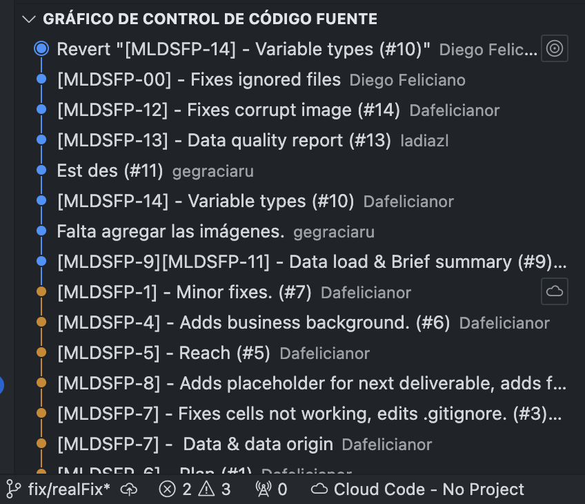

# final-term-project
Course's repository to be the source of truth for deliverables. 

# Issues
Due to the unexpected filtering of some credentials this repo had to be reinitialized but I tried to maintain the last repository commit history, making us delete some of the already existing commits. This is seen in the next images

